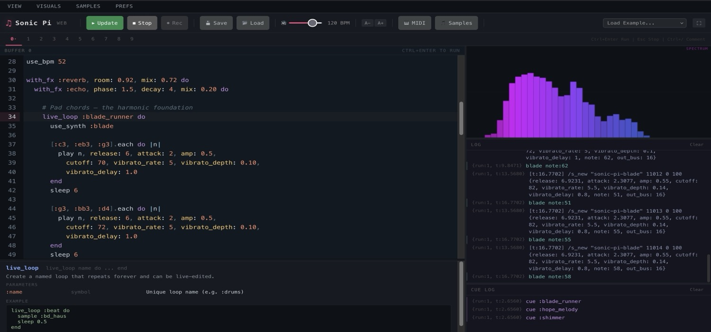

# SonicPi.js

**Your Sonic Pi code, now portable.**

<p align="center">
  
</p>

[](https://github.com/MrityunjayBhardwaj/SonicPi.js/actions/workflows/ci.yml)
[](https://github.com/MrityunjayBhardwaj/SonicPi.js/actions/workflows/deploy.yml)
[](https://www.npmjs.com/package/@mjayb/sonicpijs)


**[Try it now at sonicpi.cc](https://sonicpi.cc)** | Also checkout [Sonic Tau](https://sonic-pi.net/tau/)

---

## Make music with code. In your browser.

Open the link. Write code. Hit Run. Hear music. Change the code while it plays. That's it.

No install. No Ruby. No SuperCollider setup. Just a browser.

```ruby
live_loop :drums do
  sample :bd_haus
  sleep 0.5
  sample :sn_dub
  sleep 0.5
end
```

Press Run. Now add this while the drums are playing:

```ruby
live_loop :bass do
  use_synth :tb303
  play :e2, release: 0.3, cutoff: rrand(60, 120)
  sleep 0.25
end
```

The bass joins in. Change a number. Hit Run again. The music updates instantly. That's live coding.

---

## What can I do with it?

**Write Sonic Pi code** -- the same Ruby DSL you know from desktop. `live_loop`, `play`, `sleep`, `sample`, `with_fx`, `use_synth`, `sync`, `cue` -- it all works.

**Perform live** -- 10 buffers, hot-swap on Re-run, Alt+R/Alt+S shortcuts, fullscreen mode, spectrum visualizer. Built for the stage.

**Teach** -- zero setup means students open a URL and start coding. Friendly error messages with line numbers. Built-in examples from simple beats to full compositions.

**Embed anywhere** -- drop the engine into any web page, LMS, or creative coding tool as an npm package.

---

## Getting Started

### Option 1: Just open the website

**[sonicpi.cc](https://sonicpi.cc)** -- nothing to install.

### Option 2: Run locally

```bash
npx sonicpijs
```

### Option 3: Embed in your app

```bash
npm install @mjayb/sonicpijs
```

```ts
import { SonicPiEngine } from '@mjayb/sonicpijs'

const engine = new SonicPiEngine()
await engine.init()
await engine.evaluate(`
  live_loop :beat do
    sample :bd_haus
    sleep 0.5
  end
`)
engine.play()
```

---

## What's included

| Feature | Details |
|---------|---------|
| **66 synths** | beep, saw, prophet, tb303, supersaw, blade, hollow, pluck, piano, and more |
| **197 samples** | Kicks, snares, hats, loops, ambient, bass, electronic, tabla |
| **42 FX** | reverb, echo, distortion, flanger, slicer, wobble, chorus, pitch_shift, and more |
| **Full DSL** | live_loop, with_fx, define, in_thread, sync/cue, density, time_warp |
| **Music theory** | 30+ chord types, 50+ scales, rings, spreads, Euclidean rhythms |
| **10 buffers** | Switch between code tabs like desktop Sonic Pi |
| **Scope visualizer** | Mono, stereo, lissajous, mirror, spectrum modes |
| **MIDI I/O** | Connect hardware controllers via Web MIDI |
| **Recording** | Capture your session to WAV |
| **17 examples** | From "Hello Beep" to full Blade Runner x Techno compositions |
| **Autocomplete** | Code hints for synths, samples, FX, and parameters |
| **Help panel** | Inline docs for 33 functions with signatures and examples |
| **Preferences** | Audio, visuals, editor, and performance settings |
| **Custom samples** | Upload your own WAV/MP3/OGG files |
| **Save/Load** | Export and import your code as files |
| **Friendly errors** | 18 error patterns with "did you mean?" suggestions |

---

## Keyboard shortcuts

| Shortcut | Action |
|----------|--------|
| Ctrl+Enter / Alt+R | Run code |
| Escape / Alt+S | Stop all |
| Ctrl+/ | Toggle comment |
| F11 | Fullscreen |
| A- / A+ | Font size |

---

## How it works (for the curious)

`sleep()` returns a Promise that only the VirtualTimeScheduler can resolve. This gives JavaScript cooperative concurrency with virtual time -- multiple `live_loop`s run concurrently, each advancing through their own timeline.

Previous attempts at browser-based Sonic Pi tried to make `sleep` block the JS thread (impossible without freezing the UI). Our insight: you don't need blocking, you need scheduler-controlled Promise resolution.

The audio runs through SuperSonic -- SuperCollider's scsynth compiled to WebAssembly. Same synth definitions, same sound. The Ruby DSL is transpiled to JavaScript via a Tree-sitter AST parser.

---

## Compatibility with Desktop Sonic Pi

~95% of Sonic Pi syntax runs unmodified.

**Identical:** seeded PRNG (Mersenne Twister), synth definitions, sample library, music theory, timing semantics, hot-swap, sync/cue.

**Different:** no native OSC output (browser limitation -- use the OSC hook for host integration), browser audio latency is higher (~20ms vs ~5ms), some niche Ruby syntax may not be covered.

See [KNOWN_LIMITATIONS.md](KNOWN_LIMITATIONS.md) for the full list.

---

## Standing on the shoulders of giants

- **[Sonic Pi](https://sonic-pi.net/)** by Sam Aaron -- the inspiration for everything here
- **[SuperCollider](https://supercollider.github.io/)** -- the synthesis engine underneath
- **[Algorave community](https://algorave.com/)** -- the live coding movement that makes this meaningful

---

## Contributing

See [CONTRIBUTING.md](CONTRIBUTING.md). Issues and PRs welcome.

## License

MIT. See [LICENSE](LICENSE).
