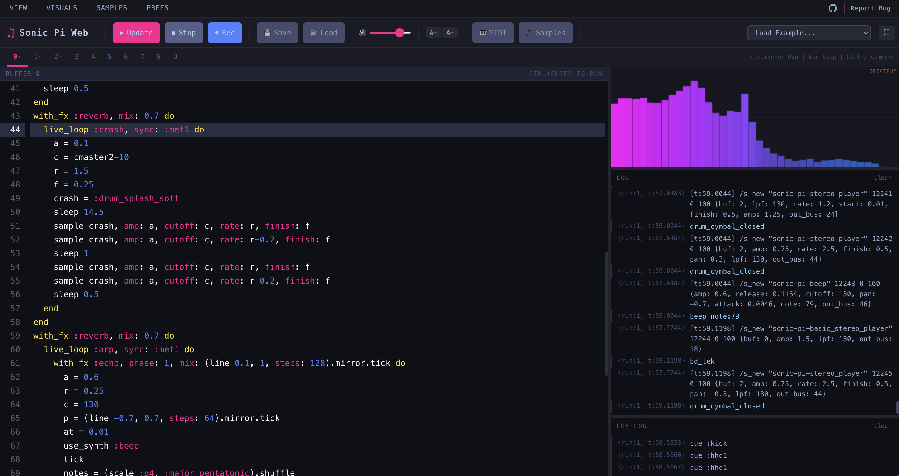

# Sonic Pi Web

**Your Sonic Pi code, now portable.**

<p align="center">
  
</p>

[](https://github.com/MrityunjayBhardwaj/SonicPi.js/actions/workflows/ci.yml)
[](https://github.com/MrityunjayBhardwaj/SonicPi.js/actions/workflows/deploy.yml)
[](https://www.npmjs.com/package/@mjayb/sonicpijs)


**[Try it now at sonicpi.cc](https://sonicpi.cc)**

---

## Make music with code. In your browser.

Sonic Pi Web is a browser-native reimplementation of [Sonic Pi](https://sonic-pi.net/)'s live coding engine. Same Ruby DSL. Same synths. Same samples. No install.

I built this because Sonic Pi changed how I think about music and code, and I wanted that experience to be one click away for anyone with a browser.

All thanks to:
- **Sonic Pi** & Sam Aaron -- for proving that code is a musical instrument
- **SuperSonic** -- the WebAssembly port of SuperCollider that makes real synthesis possible in the browser
- **AudioWorklet** -- the browser API that makes low-latency audio processing work
- **Algorave community** -- for building a culture where live coding is performance art

---

## How it works

- **`sleep()` is a scheduler-controlled Promise.** Ruby's blocking `sleep` is impossible in JS without freezing the UI. Instead, `sleep` returns a Promise that only the VirtualTimeScheduler can resolve — giving cooperative concurrency with virtual time across multiple `live_loop`s.
- **Ruby DSL → JS via Tree-sitter.** Your Sonic Pi code is parsed into an AST and transpiled to JavaScript builder chains. No regex hacks — full structural awareness of blocks, symbols, and Ruby semantics.
- **Real SuperCollider synthesis.** Audio runs through SuperSonic (scsynth compiled to WebAssembly via AudioWorklet). Same synth definitions, same sound — not a simplified approximation.

```ruby
live_loop :drums do
  sample :bd_haus
  sleep 0.5
  sample :sn_dub
  sleep 0.5
end
```

Press Run. Now add this while the drums are playing:

```ruby
live_loop :bass do
  use_synth :tb303
  play :e2, release: 0.3, cutoff: rrand(60, 120)
  sleep 0.25
end
```

The bass joins in. Change a number. Hit Run again. The music updates instantly. That's live coding.

---

## What can I do with it?

**Write Sonic Pi code** -- the same Ruby DSL you know from desktop. `live_loop`, `play`, `sleep`, `sample`, `with_fx`, `use_synth`, `sync`, `cue` -- it all works.

**Perform live** -- 10 buffers, hot-swap on Re-run, Alt+R/Alt+S shortcuts, fullscreen mode, spectrum visualizer. Built for the stage.

**Teach** -- zero setup means students open a URL and start coding. Friendly error messages with line numbers. Built-in examples from simple beats to full compositions.

**Embed anywhere** -- drop the engine into any web page, LMS, or creative coding tool as an [npm package](https://www.npmjs.com/package/@mjayb/sonicpijs).

---

## Getting Started

### Option 1: Just open the website

**[sonicpi.cc](https://sonicpi.cc)** -- nothing to install.

### Option 2: Run locally

```bash
npx sonicpijs
```

### Option 3: Embed in your app

```bash
npm install @mjayb/sonicpijs
```

```ts
import { SonicPiEngine } from '@mjayb/sonicpijs'

const engine = new SonicPiEngine()
await engine.init()
await engine.evaluate(`
  live_loop :beat do
    sample :bd_haus
    sleep 0.5
  end
`)
engine.play()
```

---

## What's included

| Feature | Details |
|---------|---------|
| **66 synths** | beep, saw, prophet, tb303, supersaw, blade, hollow, pluck, piano, and more |
| **197 samples** | Kicks, snares, hats, loops, ambient, bass, electronic, tabla |
| **42 FX** | reverb, echo, distortion, flanger, slicer, wobble, chorus, pitch_shift, and more |
| **Full DSL** | live_loop, with_fx, define, in_thread, sync/cue, density, time_warp |
| **Music theory** | 30+ chord types, 50+ scales, rings, spreads, Euclidean rhythms |
| **10 buffers** | Switch between code tabs like desktop Sonic Pi |
| **Scope visualizer** | Mono, stereo, lissajous, mirror, spectrum -- all 5 Desktop SP modes |
| **Cue Log** | Live cue/sync event stream in a dedicated panel |
| **MIDI I/O** | Connect hardware controllers via Web MIDI |
| **Recording** | Capture your session to WAV |
| **18 examples** | From "Hello Beep" to a full Blade Runner x Techno composition |
| **Autocomplete** | Code hints with inline descriptions |
| **Help panel** | 311 entries -- functions, synths, FX, and samples with params and examples |
| **Preferences** | Audio, visuals, editor, and performance settings |
| **Resizable panels** | Drag splitters to resize scope, log, cue log, and help panel |
| **Custom samples** | Upload your own WAV/MP3/OGG files |
| **Save/Load** | Export and import your code as files |
| **Friendly errors** | 20 error patterns with "did you mean?" suggestions and line highlighting |
| **Report Bug** | One-click bug report with pre-filled GitHub issue |

---

## Keyboard shortcuts

| Shortcut | Action |
|----------|--------|
| Ctrl+Enter / Alt+R | Run code |
| Escape / Alt+S | Stop all |
| Ctrl+/ | Toggle comment |
| F11 | Fullscreen |
| A- / A+ | Font size |

---

## Tech stack

TypeScript 6, Vite, Vitest (703 tests), CodeMirror 6, Web Audio API, WebAssembly.

---

## Compatibility with Desktop Sonic Pi

~95% of Sonic Pi syntax runs unmodified. 703 tests verify parity.

**Identical:** seeded PRNG (Mersenne Twister), synth definitions, sample library, music theory, timing semantics, hot-swap, sync/cue.

**Different:** browser audio latency is higher (~20ms vs ~5ms), OSC output requires a host-provided transport (hook-based), some niche Ruby syntax may not be covered.

See [KNOWN_LIMITATIONS.md](KNOWN_LIMITATIONS.md) for the full list.

---

## Check out these cool projects

- **[Sonic Tau](https://sonic-pi.net/tau/)** -- Sam Aaron's official next-gen Sonic Pi for the browser. Built with Elixir + Phoenix LiveView. The future of Sonic Pi.
- **[Strudel](https://strudel.cc/)** -- Alex McLean's live coding pattern language for the browser. Different paradigm (TidalCycles-inspired), equally mind-blowing.
- **[Tone.js](https://tonejs.github.io/)** -- Web Audio framework for building interactive music in the browser.

---

## What's New

See [Releases](https://github.com/MrityunjayBhardwaj/SonicPi.js/releases) for the changelog.

---

## Contributing

See [CONTRIBUTING.md](CONTRIBUTING.md). Issues and PRs welcome.

## License

MIT. See [LICENSE](LICENSE).
